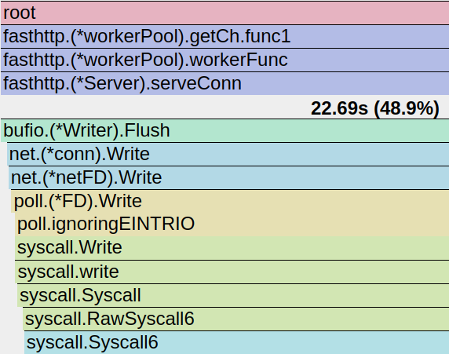

---

```sh
CGO_ENABLED=0 go build -trimpath=true -ldflags=-s
file ./app
./app

go run -trimpath=true .
	
go tool pprof -http=":8789" cpu.out

wrk -t4 -c80 -d10s http://localhost:8080/?q=1234567890
# Running 10s test @ http://localhost:8080/?q=1234567890
#   4 threads and 80 connections
#   Thread Stats   Avg      Stdev     Max   +/- Stdev
#     Latency   667.05us    1.66ms  31.01ms   92.64%
#     Req/Sec    79.46k    16.64k  119.09k    68.25%
#   3171193 requests in 10.05s, 456.67MB read
# Requests/sec: 315622.40
# Transfer/sec:     45.45MB


```


```sh
 ab -n 10000 -c 32 http://localhost:8080/?q=1234567890
```
