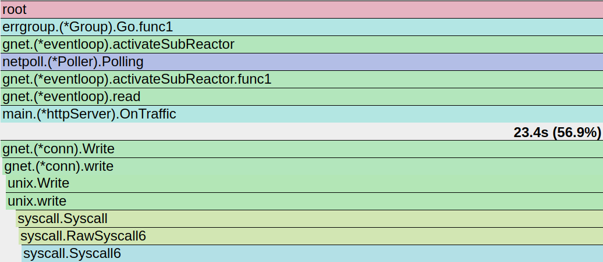

```sh
go run -trimpath=true .


wrk -t4 -c80 -d10s http://localhost:8080/?q=1234567890
# Running 10s test @ http://localhost:8080/?q=1234567890
#   4 threads and 80 connections
#   Thread Stats   Avg      Stdev     Max   +/- Stdev
#     Latency   576.76us    1.63ms  28.28ms   93.93%
#     Req/Sec    96.37k    18.93k  134.42k    58.60%
#   3845619 requests in 10.10s, 498.78MB read
# Requests/sec: 380752.58
# Transfer/sec:     49.38MB


curl -i http://localhost:8080/?q=1234567890
# Requests: 3845672, Total Elapsed Time: 38.603340236s

```




```sh
 ab -n 2208160 -c 80 http://localhost:8080/?q=1234567890
```
