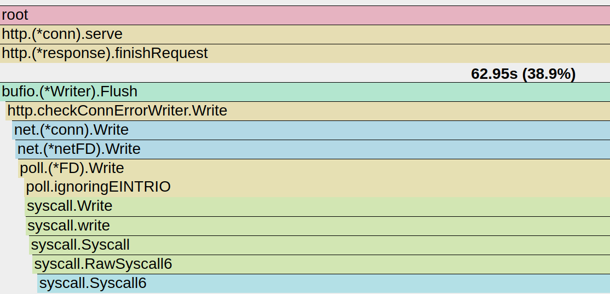

```sh
CGO_ENABLED=0 go build -trimpath=true -ldflags=-s
file ./app
./app

go run -trimpath=true .
	
go tool pprof -http=":8789" cpu.out


wrk -t4 -c100 -d30s http://localhost:8080
# Running 30s test @ http://localhost:8080
#   4 threads and 100 connections
#   Thread Stats   Avg      Stdev     Max   +/- Stdev
#     Latency     0.91ms    1.39ms  33.97ms   88.83%
#     Req/Sec    43.47k    10.23k   84.63k    69.23%
#   5192603 requests in 30.04s, 371.40MB read
# Requests/sec: 172845.26
# Transfer/sec:     12.36MB


wrk -t4 -c100 -d30s http://localhost:8080/?q=1234567890
# Running 30s test @ http://localhost:8080/?q=1234567890
#   4 threads and 100 connections
#   Thread Stats   Avg      Stdev     Max   +/- Stdev
#     Latency     1.00ms    1.29ms  24.90ms   86.98%
#     Req/Sec    36.01k     7.83k   69.25k    69.90%
#   4300418 requests in 30.04s, 520.85MB read
# Requests/sec: 143167.42


```


```sh
 ab -n 2208160 -c 80 http://localhost:8080/?q=1234567890
# This is ApacheBench, Version 2.3 <$Revision: 1879490 $>
# Copyright 1996 Adam Twiss, Zeus Technology Ltd, http://www.zeustech.net/
# Licensed to The Apache Software Foundation, http://www.apache.org/

# Benchmarking localhost (be patient)
# Completed 220816 requests
# Completed 441632 requests
# Completed 662448 requests
# Completed 883264 requests
# Completed 1104080 requests
# Completed 1324896 requests
# Completed 1545712 requests
# Completed 1766528 requests
# Completed 1987344 requests
# Completed 2208160 requests
# Finished 2208160 requests


# Server Software:        
# Server Hostname:        localhost
# Server Port:            8080

# Document Path:          /?q=1234567890
# Document Length:        16 bytes

# Concurrency Level:      80
# Time taken for tests:   122.136 seconds
# Complete requests:      2208160
# Failed requests:        0
# Total transferred:      293685280 bytes
# HTML transferred:       35330560 bytes
# Requests per second:    18079.47 [#/sec] (mean)
# Time per request:       4.425 [ms] (mean)
# Time per request:       0.055 [ms] (mean, across all concurrent requests)
# Transfer rate:          2348.21 [Kbytes/sec] received

# Connection Times (ms)
#               min  mean[+/-sd] median   max
# Connect:        0    2   0.7      2      16
# Processing:     1    2   0.7      2      26
# Waiting:        0    1   0.7      1      16
# Total:          2    4   0.8      4      39

# Percentage of the requests served within a certain time (ms)
#   50%      4
#   66%      5
#   75%      5
#   80%      5
#   90%      5
#   95%      6
#   98%      7
#   99%      7
#  100%     39 (longest request)
```
